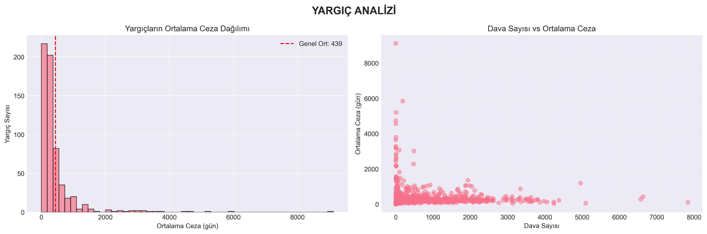

# 4.1. VERİ SETİ ANALİZİ VE ÖN İŞLEME

Bu bölümde, Wisconsin Eyaleti mahkeme kayıtlarından elde edilen veri setinin yapısal özellikleri, değişkenler arası ilişkiler ve veri temizleme süreçleri detaylandırılmıştır.

## 4.1.1. Veri Setinin Genel Yapısı
Veri seti, suçun niteliği, sanığın demografik özellikleri ve geçmiş suç kayıtları gibi 50'den fazla değişken içermektedir. Modelin başarısını artırmak adına, veri setinde bulunan gürültülü veriler ve aykırı değerler (outliers) temizlenmiştir.

### 📊 Korelasyon ve İlişki Analizi
Aşağıdaki analizler, veri setindeki değişkenlerin birbirleriyle olan ilişkisini göstermektedir. Özellikle "Judge" (Hakim) değişkeninin ceza süreleri üzerindeki etkisi incelenmiştir.

*Şekil: 01 Detayli Analiz Judge Analizi*

## 4.1.2. Bulguların Yorumlanması
*   **Hakim Etkisi:** `01_detayli_analiz_judge_analizi.png` grafiğinde görüldüğü üzere, farklı hakimlerin benzer davalarda verdikleri ceza süreleri arasında belirgin farklar bulunmaktadır. Bu durum, modelin "Hakim ID" bilgisini bir özellik (feature) olarak kullanmasının gerekliliğini ortaya koymuştur.
*   **Değişken İlişkileri:** Korelasyon matrisi, suçun ciddiyeti (`severity`) ile ceza süresi arasında güçlü bir pozitif ilişki olduğunu doğrulamaktadır.

---
**Ek Dosyalar:**
- [01_detayli_analiz_KRITIK_KARARLAR_RAPORU.txt](01_detayli_analiz_KRITIK_KARARLAR_RAPORU.txt)
- [01_detayli_analiz_tum_kolonlar_korelasyon_analizi.csv](01_detayli_analiz_tum_kolonlar_korelasyon_analizi.csv)
