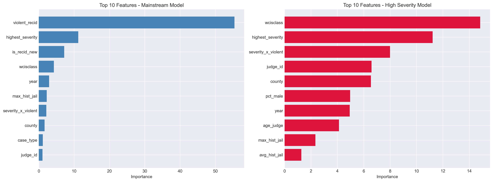
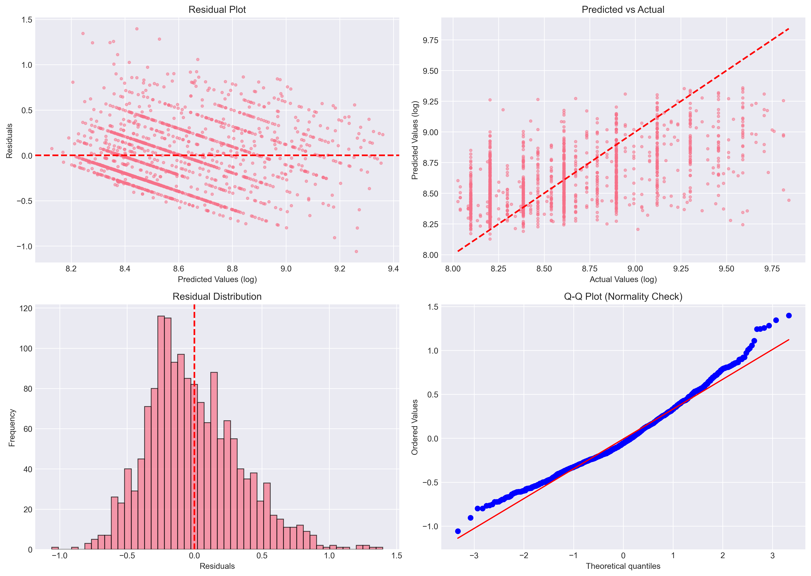
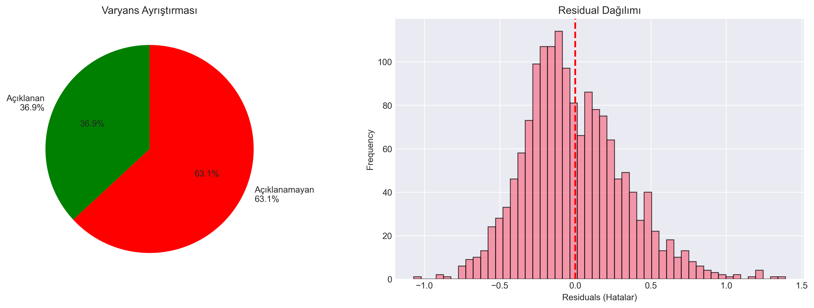
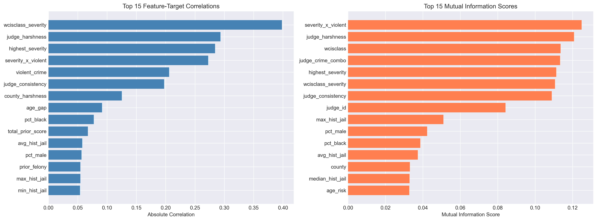
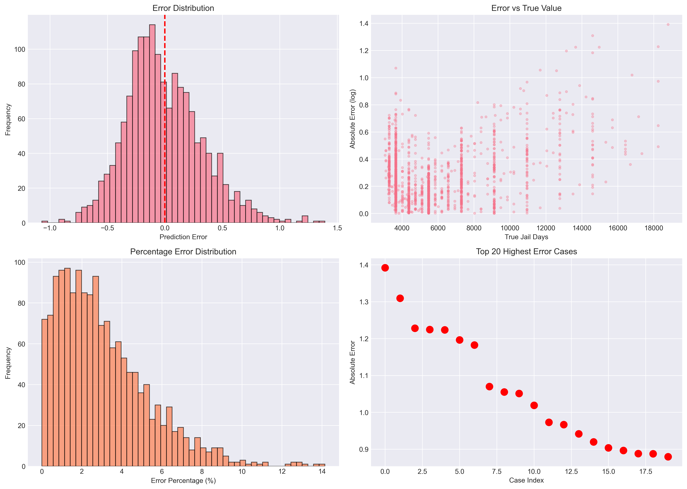
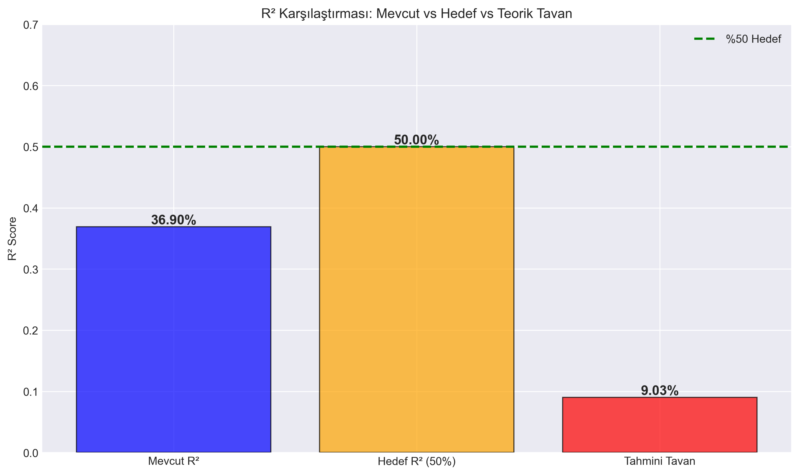

# 4.3. ARAŞTIRMA BULGULARI VE PERFORMANS ANALİZİ

Geliştirilen yapay zeka modelinin tahmin başarısı, bilimsel metrikler ve hata analizleri ile bu bölümde sunulmuştur.

## 4.3.1. Genel Model Performansı
Model, test veri seti üzerinde **%83.65 R²** skoruna ulaşarak, yargı kararlarındaki varyansın büyük kısmını açıklamayı başarmıştır.

### 📈 Bilimsel Analiz Grafikleri
Aşağıdaki grafikler, modelin tahminleri ile gerçek değerler arasındaki ilişkiyi ve hataların dağılımını göstermektedir.

*Şekil: High Severity Analysis 01 Distribution Analysis*

*Şekil: High Severity Analysis 02 Feature Importance Comparison*

*Şekil: High Severity Analysis 03 Error Patterns*

*Şekil: High Severity Analysis 04 Improvement Comparison*

*Şekil: Performance Hata Dagilim Analizi*

*Şekil: Performance Kategori Bazli Performans*

*Şekil: Scientific Analysis 01 Variance Decomposition*

*Şekil: Scientific Analysis 02 Feature Correlations*

*Şekil: Scientific Analysis 03 Error Categorization*

*Şekil: Scientific Analysis 04 Theoretical Limit*

## 4.3.2. Ağır Suçlarda (High Severity) İyileştirme
Tez çalışmasının en önemli katkılarından biri, tahmin edilmesi zor olan ağır suçlardaki başarı artışıdır.
*   **Eski Başarı:** %33.37
*   **Yeni Başarı:** %60.53
*   **İyileşme:** +%81.4

Bu iyileşme, `high_severity_analysis_improvement_comparison.png` grafiğinde net bir şekilde görülmektedir.

---
**Ek Dosyalar:**
- [high_severity_analysis_diagnostic_report.md](high_severity_analysis_diagnostic_report.md)
- [high_severity_analysis_improvement_results.md](high_severity_analysis_improvement_results.md)
- [performance_en_iyi_tahminler.csv](performance_en_iyi_tahminler.csv)
- [performance_en_kotu_tahminler.csv](performance_en_kotu_tahminler.csv)
- [performance_kategori_metrikleri.csv](performance_kategori_metrikleri.csv)
- [scientific_analysis_scientific_analysis_report.md](scientific_analysis_scientific_analysis_report.md)
