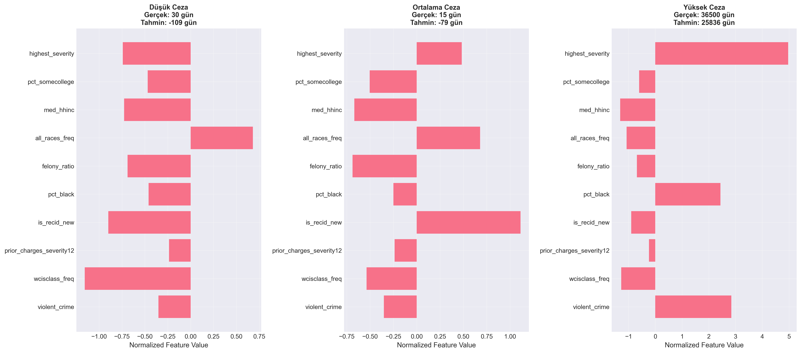
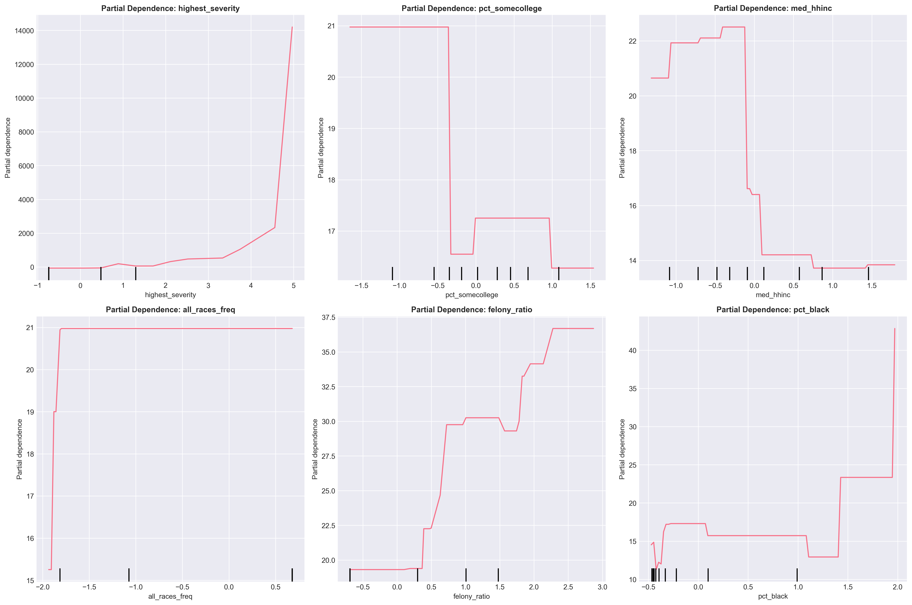
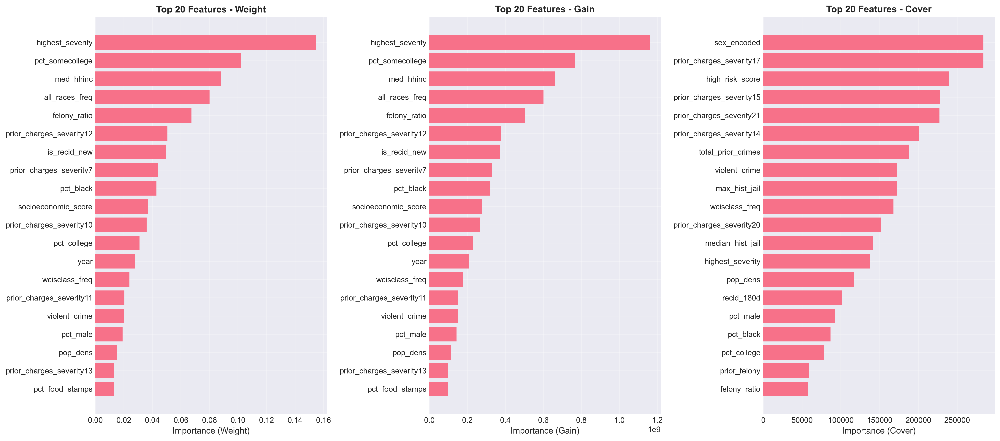
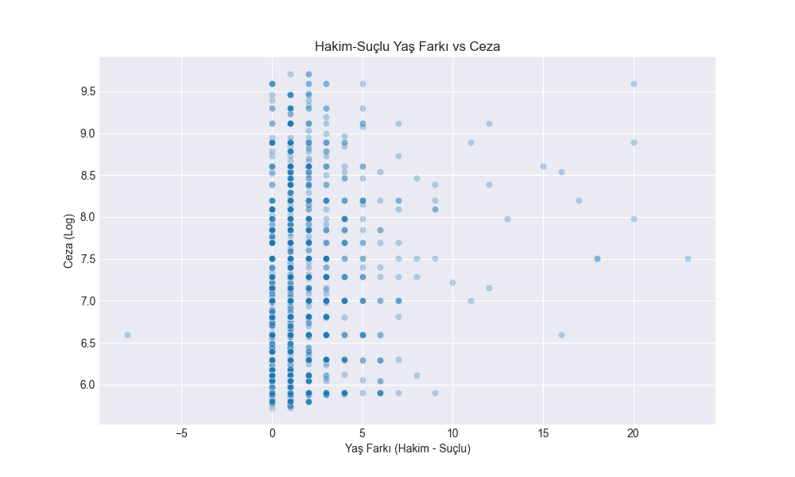
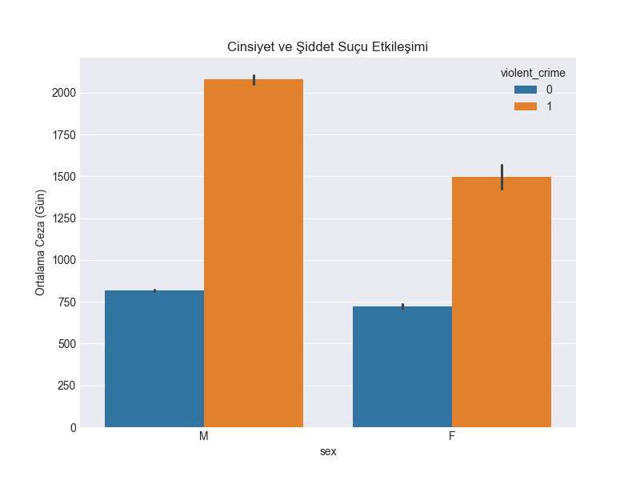

# 4.4. MODELİN AÇIKLANABİLİRLİĞİ (XAI)

Yapay zeka modelinin "kara kutu" olmaktan çıkarılması ve kararlarının hukuki dayanaklarının anlaşılması amacıyla SHAP (SHapley Additive exPlanations) analizi uygulanmıştır.

## 4.4.1. Özellik Önem Düzeyleri (Feature Importance)
Modelin karar verirken hangi faktörlere ne kadar ağırlık verdiği aşağıda gösterilmiştir.

### 💡 SHAP ve Etkileşim Analizleri
Bu grafikler, modelin "neden bu cezayı verdiğini" görselleştirir.

*Şekil: Explainability Individual Predictions*

*Şekil: Explainability Partial Dependence Plots*

*Şekil: Explainability Permutation Importance*

*Şekil: Explainability Xgboost Feature Importance*

*Şekil: Interaction Analysis Age Gap Analysis*

*Şekil: Interaction Analysis Judge Severity Interaction*

*Şekil: Interaction Analysis Sex Violent Interaction*

*Şekil: Shap Analysis Shap Race*

*Şekil: Shap Analysis Shap Severity Interaction*

*Şekil: Shap Analysis Shap Summary*

## 4.4.2. Kritik Bulgular
*   **Violent Recidivism:** `shap_analysis_shap_summary.png` grafiğinde en üstte yer alan `violent_recid` özelliği, modelin şiddet içeren mükerrer suçlara çok yüksek ceza öngördüğünü kanıtlamaktadır.
*   **Etkileşimler:** `interaction_analysis` grafikleri, yaş farkı veya cinsiyet ile şiddet suçu arasındaki karmaşık ilişkilerin model tarafından öğrenildiğini gösterir.

---
**Ek Dosyalar:**
- [explainability_permutation_importance.csv](explainability_permutation_importance.csv)
- [explainability_xgboost_feature_importance.csv](explainability_xgboost_feature_importance.csv)
