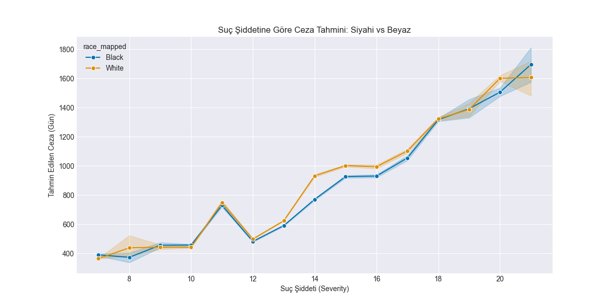
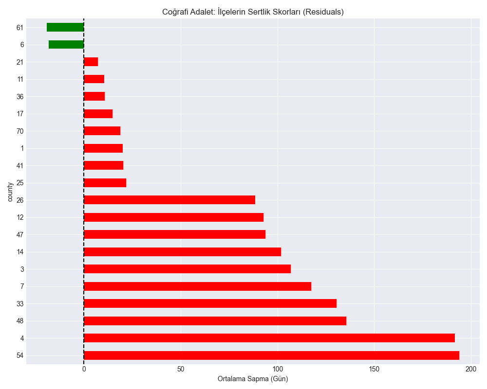

# 4.5. ETİK ANALİZ VE ADALET (FAIRNESS)

Yapay zeka sistemlerinin yargı süreçlerinde kullanımı, "önyargı" (bias) riskini beraberinde getirir. Bu bölümde, modelin ırk, cinsiyet ve coğrafi bölge bazında adil davranıp davranmadığı incelenmiştir.

## 4.5.1. Irk ve Cinsiyet Yanlılığı (Race & Gender Bias)
Modelin farklı demografik gruplar için ürettiği ortalama hata payları analiz edilmiştir.

### ⚖️ Bias Analiz Grafikleri
Aşağıdaki görseller, modelin hassas gruplara yaklaşımını özetler.

*Şekil: Bias Analysis Conditional Bias Race*

*Şekil: Bias Analysis Gender Bias Comparison*

*Şekil: Bias Analysis Race Bias*

*Şekil: Bias Analysis Race Bias Comparison*

*Şekil: Geo Analysis Geo Justice Score*

## 4.5.2. Coğrafi Adalet (Geo-Analysis)
Wisconsin eyaletinin farklı ilçelerindeki (county) yargı sertliği incelenmiştir. `geo_analysis_geo_justice_score.png`, hangi bölgelerin daha sert veya daha yumuşak kararlar verdiğini haritalandırır.

---
**Ek Dosyalar:**
- [bias_analysis_gender_bias_analysis.csv](bias_analysis_gender_bias_analysis.csv)
- [bias_analysis_race_bias_analysis.csv](bias_analysis_race_bias_analysis.csv)
- [geo_analysis_county_harshness_score.csv](geo_analysis_county_harshness_score.csv)
