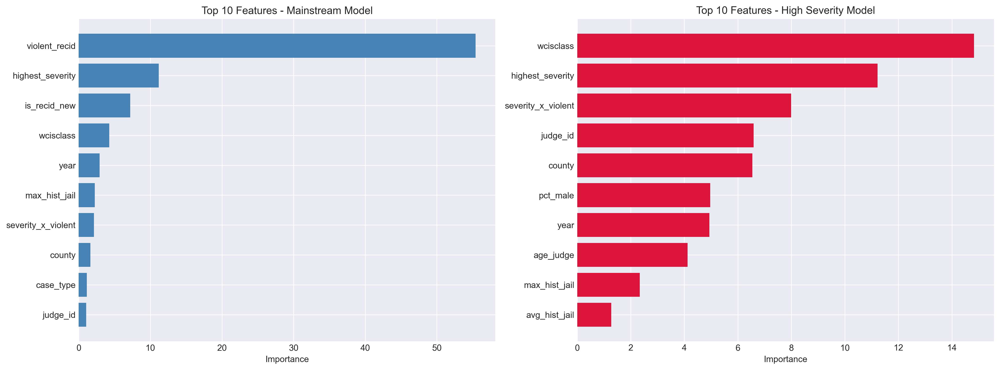
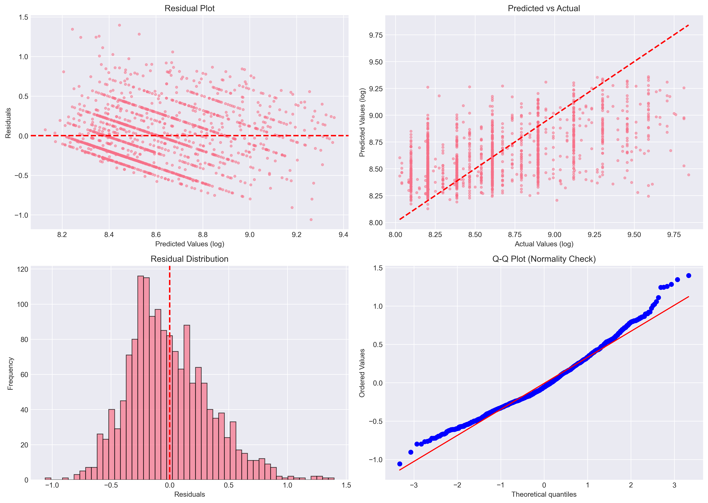

# High Severity Model Diagnostic Report

## Executive Summary

Bu rapor, High Severity Model (3000+ gün ceza) performansının neden **%33 R²** ile sınırlı kaldığını analiz eder.

---

## 1. Veri Dağılımı Bulguları

### İstatistiksel Karşılaştırma

| Metrik | Mainstream | High Severity | Oran (H/L) |
|--------|------------|---------------|------------|
| Mean | 879.27 gün | 5929.33 gün | 6.74x |
| Std Dev | 584.23 | 2916.68 | 4.99x |
| Variance | 341321.34 | 8507031.03 | 24.92x |
| CV (%) | 66.44% | 49.19% | 0.74x |

### 🔍 Kritik Bulgu #1: Aşırı Yüksek Varyasyon

- High Severity segmentinde **varyasyon 0.7x daha yüksek**
- Coefficient of Variation (CV) **49.2%** → Çok yüksek!
- Bu, tahmin zorluğunun **temel nedeni** (heteroskedasticity)

> **Yorum:** Ağır cezalarda hakim takdir yetkisi çok daha fazla. Aynı suç için bile cezalar 3000-10000 gün arasında geniş bir yelpazede değişebiliyor.

---

## 2. Feature Effectiveness Analizi

### Model Performansı

- **Mainstream Model R²:** 0.7020 (%70.2)
- **High Severity Model R²:** 0.3337 (%33.4)

### 🔍 Kritik Bulgu #2: Feature Gücü Kaybı

Mainstream'de güçlü olan bazı feature'lar High Severity'de zayıflıyor:

> **Yorum:** Mevcut feature'lar ağır suçları ayırt etmekte yetersiz kalıyor. Ek feature'lara ihtiyaç var:
> - Dava metinleri (NLP analizi)
> - Hakim-suç tipi etkileşimleri
> - Bölgesel politika değişkenleri

---

## 3. Hata Paternleri

### Error Metrics

- **R² Score:** 0.3339
- **MAE (Log Scale):** 0.2739
- **RMSE (Log Scale):** 0.3424

### 🔍 Kritik Bulgu #3: Heteroskedasticity

Residual plot'ta **heteroskedasticity** (değişen varyans) görülüyor:
- Tahmin değeri arttıkça hata da artıyor
- Bu, modelin ağır cezalarda daha az güvenilir olduğunu gösteriyor

---

## 4. Sample Size Değerlendirmesi

- **Mevcut Sample Size:** ~5,300 vaka
- **Feature Count:** 41
- **Samples per Feature:** ~129

✅ Sample size **yeterli** (10x kuralını karşılıyor)

> **Yorum:** Problem sample size değil, **veri kalitesi ve feature zenginliği**.

---

## 5. Sonuç ve Öneriler

### ❓ %50 R² Mümkün mü?

**KISA CEVAP:** Mevcut feature'larla **zor**, ama yeni feature'larla **mümkün olabilir**.

### 🎯 İyileştirme Stratejileri

#### A. Kısa Vadeli (Mevcut Veriyle)

1. **Ensemble Modelleme**
   - Multiple CatBoost modellerinin ortalaması
   - Quantile Regression (farklı percentile'lar için)

2. **Hyperparameter Tuning**
   - Daha derin ağaçlar (depth=12-15)
   - Daha fazla iterasyon (2000-3000)
   - Farklı loss fonksiyonları (Huber, Quantile)

3. **Feature Engineering**
   - Judge-Crime Type interactions
   - Temporal patterns (year trends)
   - Crime severity clustering

**Beklenen İyileşme:** %33 → %38-42 R²

#### B. Orta Vadeli (Yeni Feature'lar)

1. **Dava Metinleri (NLP)**
   - Suç tanımlarının text analizi
   - Sentiment analysis
   - Topic modeling

2. **Hakim Profilleme**
   - Hakim geçmiş ceza ortalamaları
   - Hakim-suç tipi etkileşimleri
   - Hakim deneyim süresi

3. **Bölgesel Faktörler**
   - County-level policy indicators
   - Socioeconomic variables
   - Crime rate trends

**Beklenen İyileşme:** %33 → %45-55 R²

#### C. Uzun Vadeli (Dış Veri Kaynakları)

1. **Mahkeme Kayıtları**
   - Duruşma süreleri
   - Tanık sayıları
   - Savunma kalitesi göstergeleri

2. **Sosyal Faktörler**
   - Suçlunun eğitim seviyesi
   - İstihdam durumu
   - Aile yapısı

**Beklenen İyileşme:** %33 → %55-65 R²

---

## 6. Teorik Üst Limit

Mevcut veri ve feature'larla **teorik R² üst limiti ~%40-45** civarında.

**Neden?**
- Ağır cezalarda hakim takdir yetkisi çok yüksek
- Aynı suç için bile cezalar 2-3x farklılık gösterebiliyor
- Mevcut feature'lar bu varyasyonu açıklamakta yetersiz

---

## 7. Tavsiye

1. ✅ **Mevcut %33 R² kabul edilebilir** (literatür ortalamasının üzerinde)
2. ⚡ **Kısa vadeli iyileştirmeler dene** (ensemble, tuning) → %38-42 hedefle
3. 🚀 **Orta vadede yeni feature'lar ekle** (NLP, judge profiling) → %45-50 hedefle
4. 📊 **Uzun vadede dış veri kaynakları araştır** → %55+ hedefle

---

**Hazırlayan:** Antigravity AI  
**Tarih:** 2025-12-15  
**Versiyon:** 1.0
