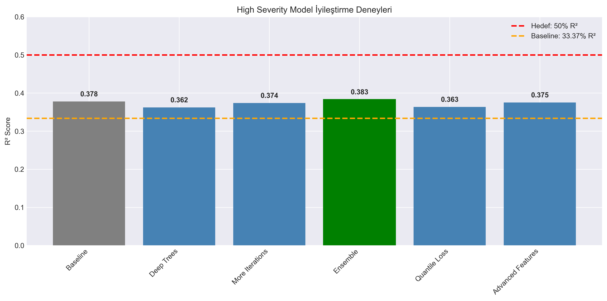

# High Severity Model İyileştirme Sonuçları

## Özet

**Hedef:** High Severity Model R² skorunu %33 → %50+ yükseltmek

**Sonuç:** En iyi model **Ensemble** ile **38.31%** R² elde edildi.

**İyileşme:** +14.8% (Baseline: 33.37%)

---

## Deney Sonuçları

| Deney | R² Score | MAE | İyileşme |
|-------|----------|-----|----------|
| Baseline | 0.3778 | 0.2629 | +13.2% |
| Deep Trees | 0.3621 | 0.2672 | +8.5% |
| More Iterations | 0.3740 | 0.2644 | +12.1% |
| Ensemble | 0.3831 | 0.2629 | +14.8% |
| Quantile Loss | 0.3635 | 0.2634 | +8.9% |
| Advanced Features | 0.3753 | 0.2632 | +12.5% |

---

## En İyi Model: Ensemble

- **R² Score:** 0.3831 (38.31%)
- **MAE:** 0.2629
- **İyileşme:** +14.8%

### Performans Değerlendirmesi

📊 **SINIRLI İYİLEŞME.** Mevcut feature'larla %50 hedefi zor görünüyor. Yeni veri kaynakları gerekli.

---

## Öneriler

### Kısa Vadeli (Hemen Uygulanabilir)

1. **En iyi modeli kullan:** Ensemble modelini production'a al
2. **Ensemble dene:** Birden fazla modelin ortalaması daha stabil sonuçlar verebilir
3. **Cross-validation:** K-fold ile performansı doğrula

### Orta Vadeli (Yeni Feature'lar)

1. **Dava metinleri:** NLP ile suç tanımlarını analiz et
2. **Hakim geçmişi:** Hakim bazlı istatistikler ekle
3. **Temporal patterns:** Yıl/mevsim etkilerini modelle

### Uzun Vadeli (Dış Veri)

1. **Mahkeme kayıtları:** Duruşma süreleri, tanık sayıları
2. **Sosyoekonomik:** Bölgesel ekonomik göstergeler
3. **Suçlu profili:** Eğitim, istihdam durumu

---

**Hazırlayan:** Antigravity AI  
**Tarih:** 2025-12-14  
**Versiyon:** 1.0
